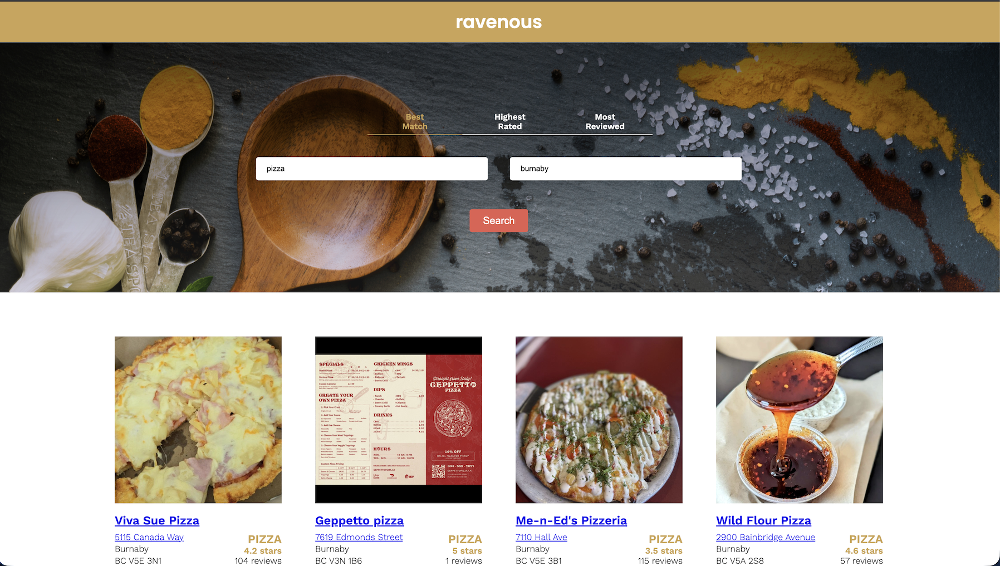

# Ravenous



A production-ready front-end project that searches the Yelp Fusion API for local businesses. Provide a valid API key and the app returns live results with details like rating, review count, category, and location.

## Highlights
- **Real data**: Fetches directly from the Yelp Fusion API using configurable search term, location, and sort criteria.
- **Responsive experience**: Built in React with modern hooks and state management patterns.
- **User-friendly filtering**: Supports search term input plus popular sort options (`Best Match`, `Highest Rated`, `Most Reviewed`).
- **Configurable auth**: Centralizes Yelp API key management so you can plug in your own credentials quickly.

## Prerequisites
- Node.js 18+ and npm
- Yelp Fusion API account for generating an API key

## Setup
1. Install dependencies:
   ```bash
   npm install
   ```
2. Open `src/utils/yelp.js` and replace the `apiKey` string with your own Yelp Fusion API key (keep it private—do not commit your real key).
3. (Optional) If you prefer using environment variables, load the key from `process.env` in `src/utils/yelp.js` and define it in a local `.env` file ignored by Git.

## Running the App
- Start the development server: `npm start`
- Visit `http://localhost:3000` in your browser
- Enter a search term (e.g., "pizza") and a location (e.g., "New York")
- Choose a sort option and click `Let's Go` to fetch and display live results

## Project Structure
- `src/components`: Presentational and container React components that render the search bar and results list.
- `src/utils/yelp.js`: Handles API authorization headers, query assembly, and response normalization.
- `public`: Base HTML template and static assets served by Vite/CRA.
- `docs/media`: Project documentation assets, including the UI screenshot used above.

## Technology Stack
- React with functional components and hooks
- Modern JavaScript (ES6+)
- Yelp Fusion REST API
- CSS modules for scoped styling

## Contributing
This repo reflects the completed Codecademy Ravenous project. Issues and pull requests are welcome if you find bugs, but the core feature set is currently complete.

## License
Distributed for educational purposes. Review the Yelp Fusion API terms of use before deploying publicly.
